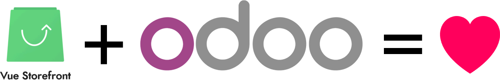
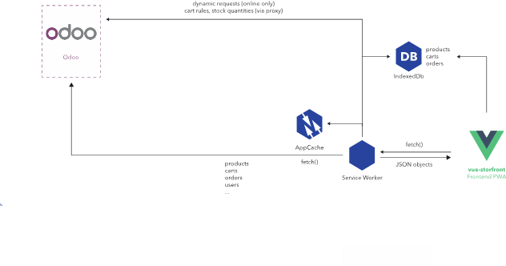
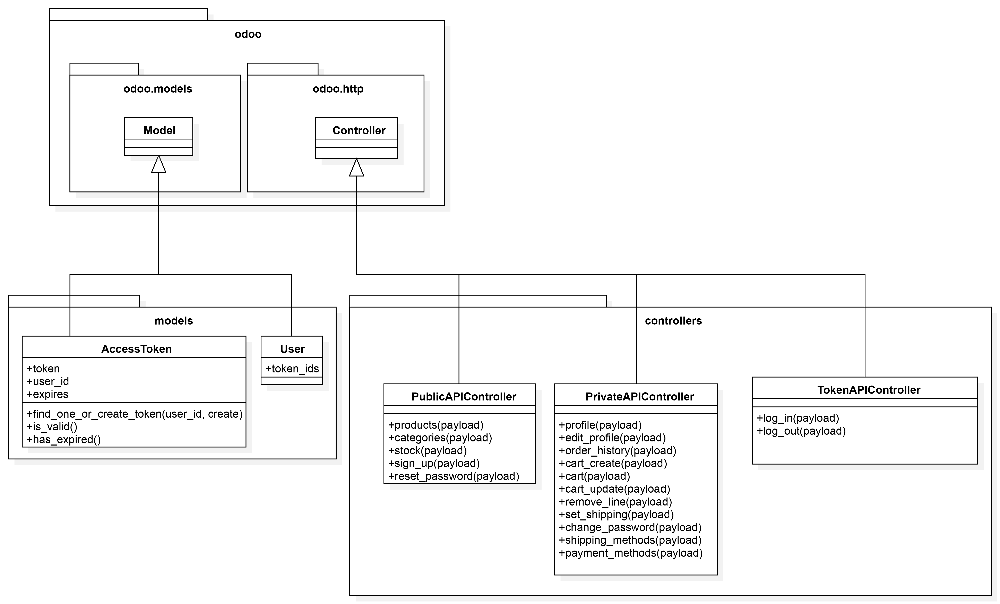
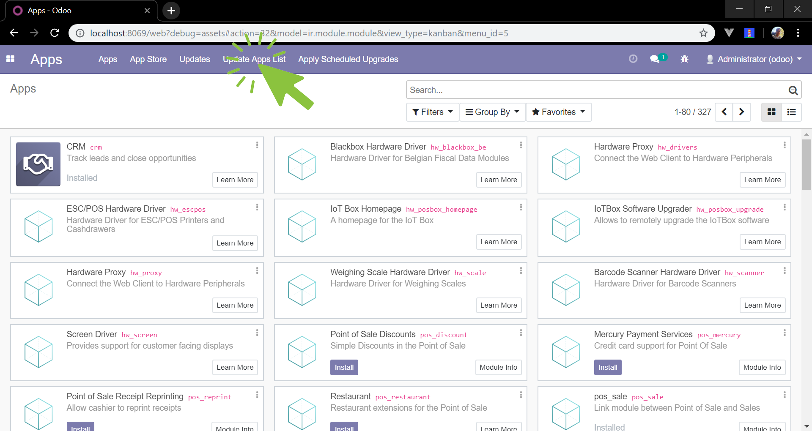
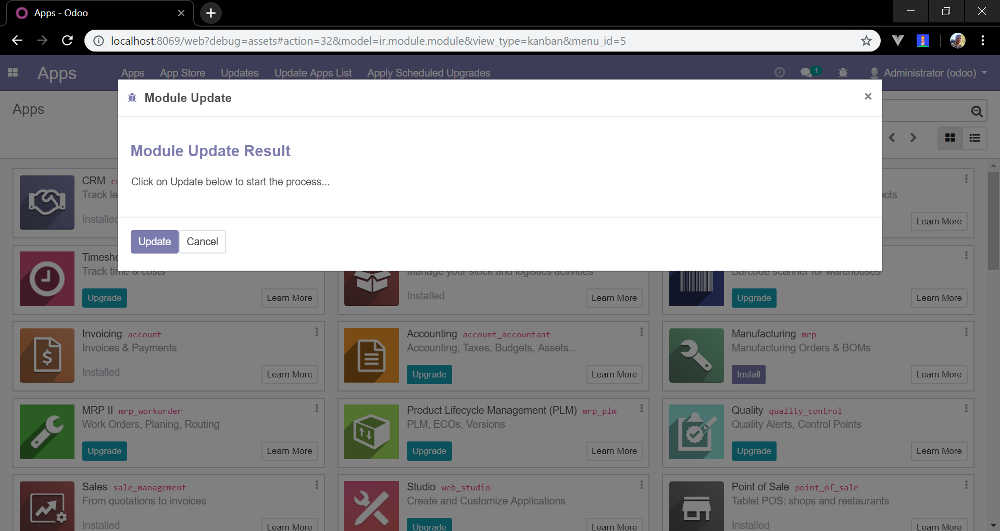
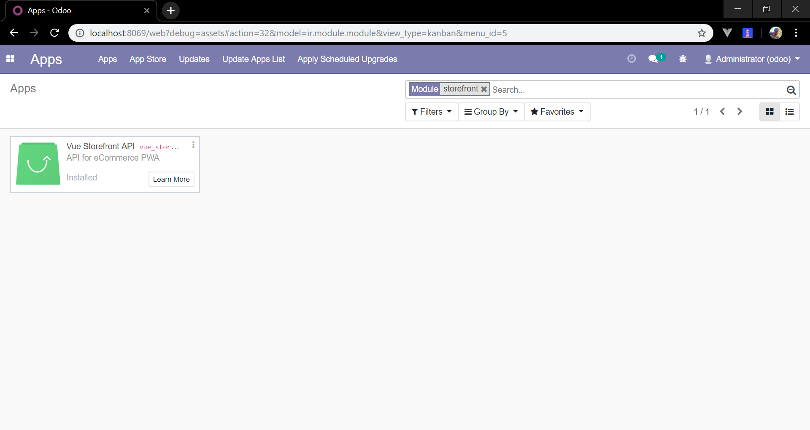
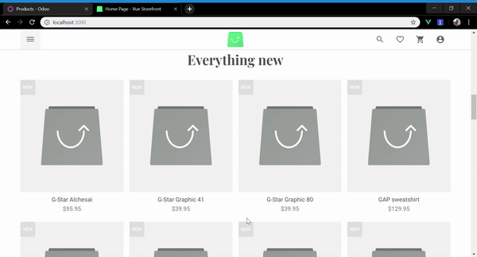
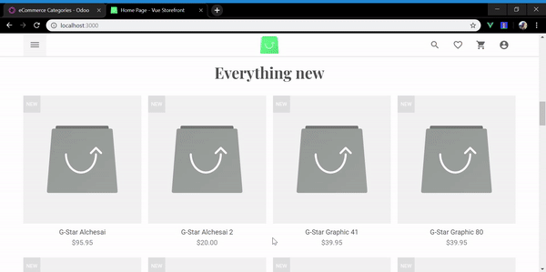
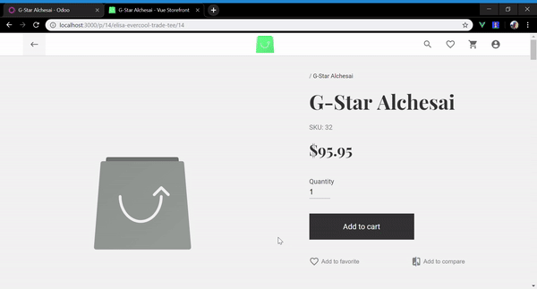

# Odoo module for Vue Storefront

## Why Odoo?
In contrast of eCommerce integration solutions, Odoo is unique in that it includes ERP, eCommerce and CMS functionalities without the need for additional solutions. As explained in the official website, Odoo is a suite of open-source business apps that cover all the company needs: CRM, eCommerce, accounting, inventory, point of sale, project management, etc. All in all, Odoo's unique value proposition is to be at the same time very easy to use and fully integrated.

## Why Vue Storefront?

Vue Storefront offers a mobile native-like user experience:

- A look and feel that is integrated with the native platform, which implies:
  - An app icon on the home screen.
  - App is able to run full screen.
- A decrease in loading times after the app installs the Service Workers, thanks to caching layouts and content. The mobile app tries to act as immediately as possible on user input, avoiding the use of the internet connection as much as possible.
- Re-engaging with users via push notifications.

Vue Storefront avoids the complexity of having to maintain several native developments – for instance, one for Android and one for iOS –, having a single platform to avoid extra development costs. Furthermore, with the possibility of enabling Server-Side Rendering for the load of the first webpage, we can remark the importance of SEO within the eCommerce industry and offer a solution capable of being crawled by search engines.

## Modifying the default architecture of Vue Storefront

By default, Vue Storefront includes a NoSQL/ElasticSearch database back-end within its architecture (https://docs.vuestorefront.io/guide/#what-is-vue-storefront). However, in order to avoid the maintenance of two different data stores, the proposed architecture for this project removes the Elastic Search data store in favour of directly connecting the front-end with the Odoo back-end. As a result, the new architecture is based on the fact that the front-end should be able to directly crawl the Odoo back-end API, as it is presented with the following diagram.

The class called SearchAdapter is a client-side code which is responsible of retrieving the following data from the back-end:
-  Product
-  Attribute
-  Category
-  Tax rule

  

As a result, this class is responsible of loading the product listing that appears on the home screen and category pages, not only when the user makes a search.
While the default SearchAdapter provided by Vue Storefront retrieves data from the ElasticSearch back-end, this project uses a RESTful API using JSON format as back-end. 

Changes that must be done in order to achieve a working communication between the front-end and the Odoo back-end are avaliable on this repo:

[https://github.com/cristian-g/vue-storefront](https://github.com/cristian-g/vue-storefront/compare/5c3f4aa2f827b4910248f4a666b24e93ba5d5248...develop)

## Odoo module

The API development of this project is packaged as an Odoo module, which is composed by the following elements:

- Controllers
- Business objects
- Data files
- Static web data

### Controllers

They are declared as Python classes that handle requests by extending the Controller class from odoo.http package. In the case of this project, there are three Controllers:

#### PublicAPIController

- Handles requests which do not use user authentication.
- Examples: retrieve products, sign up, etc.

#### PrivateAPIController

- Handles requests which can use user authentication (it can either be required or optional).
- Examples: add product to cart, edit profile, etc.

#### TokenAPIController

- Handles requests about generating or invalidating authentication tokens. It receives the credentials of the user – email and password – and then returns the computed token.

### Business objects

They are declared as Python classes extending Model class from odoo.models package which integrates them into the automated persistence system (database). In the case of this project:

- **AccessToken** is a new model created to encapsulate the attributes of each authentication token, such as its lifetime and the related user.
- **User** model has been explicitly created in order to extend the existing User model to add the related identification tokens.

### Data files

In the case of this project, it consists in an XML file declaring configuration data (module parameterization). It is named &quot;ir\_config\_param.xml&quot; inside the &quot;data&quot; folder and contains a parameter, which is the number of seconds of lifetime of the authentication token.

### Static web data

They are static assets, such as images, CSS files or JavaScript files that can be used by the web interface or Odoo website. In the case of this project, they are located inside the &quot;static&quot; folder, which includes the &quot;description&quot; assets, which are used to display the module within the Odoo administration panel.

- icon.png
- index.html (contains module title and description)
- main\_screenshot.png

## Installation of the Odoo module
1. `cd C:\Program Files (x86)\Odoo 12.0\server\odoo\addons`
2. `git clone https://github.com/cristian-g/vsf-odoo.git vue_storefront`
3. Update apps/modules list

4. Install module

## Installation of Vue Storefront
Note that the Odoo module just includes the needed API. Continue with the Vue Storefront installation:
[https://github.com/DivanteLtd/vue-storefront/blob/master/docs/guide/installation/production-setup.md](https://github.com/DivanteLtd/vue-storefront/blob/master/docs/guide/installation/production-setup.md)

## Examples
### Product listing

### Categories and subcategories

### Variants

## Roadmap

- Open-source alpha release (June) - Done
- Beta release (July)

## The license

Odoo module for Vue Storefront source code is completely free and released under the [MIT License](https://github.com/cristian-g/vsf-odoo/blob/master/LICENSE).

## Contributing

If you like the idea behind Odoo and Vue Storefront and want to become a contributor - do not hesitate and check our [list of the active issues](https://github.com/cristian-g/vsf-odoo/issues) or contact me directly via vsfodoo@cristiangonzalez.com.

If you have discovered a 🐜 or have a feature suggestion, feel free to create an issue on Github.
